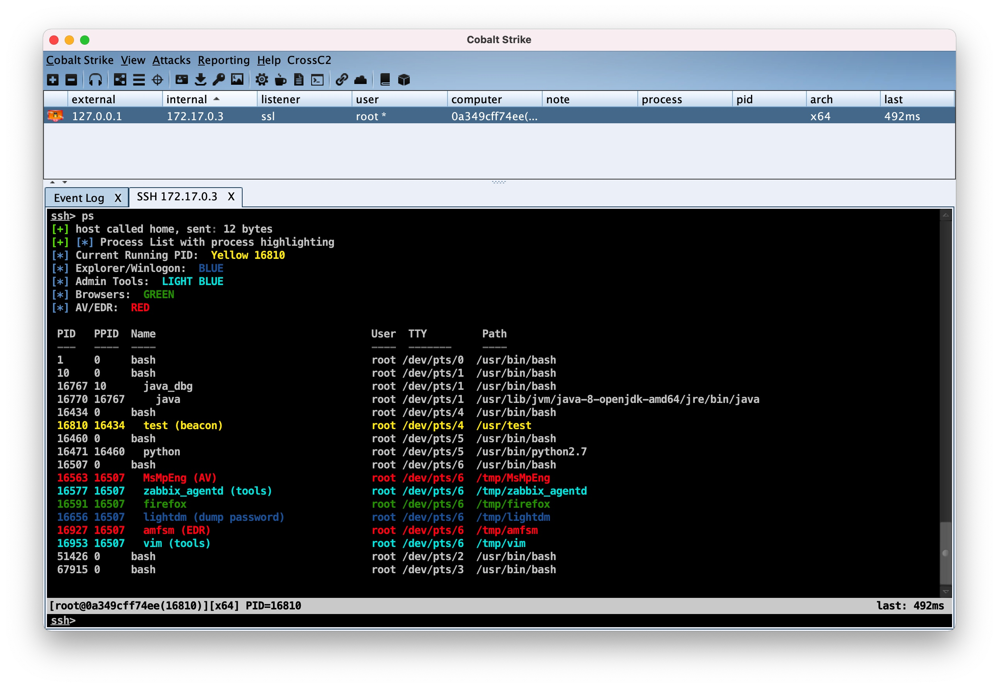
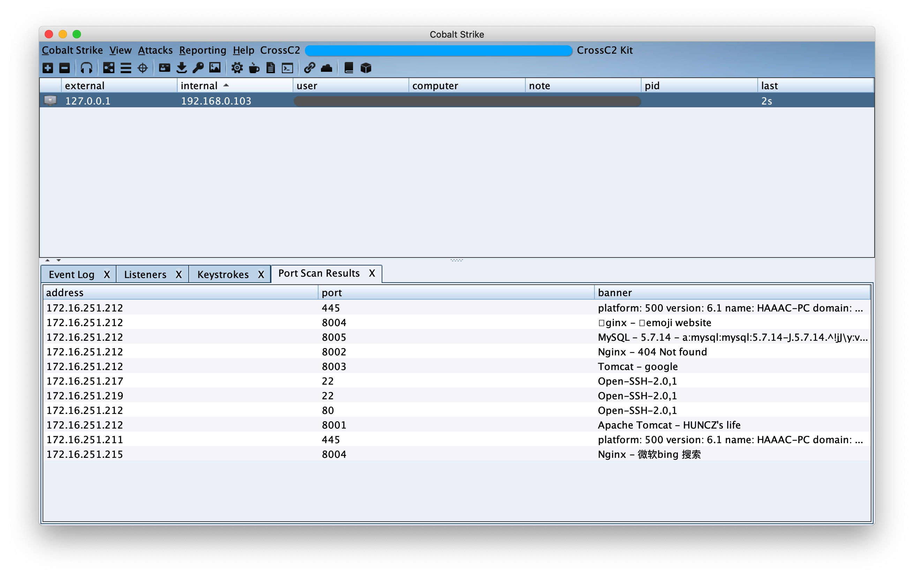
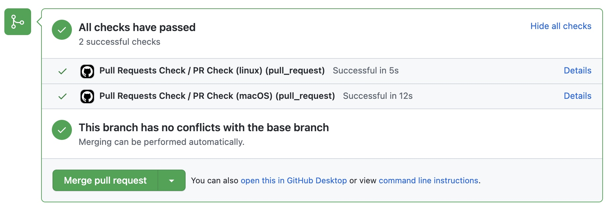
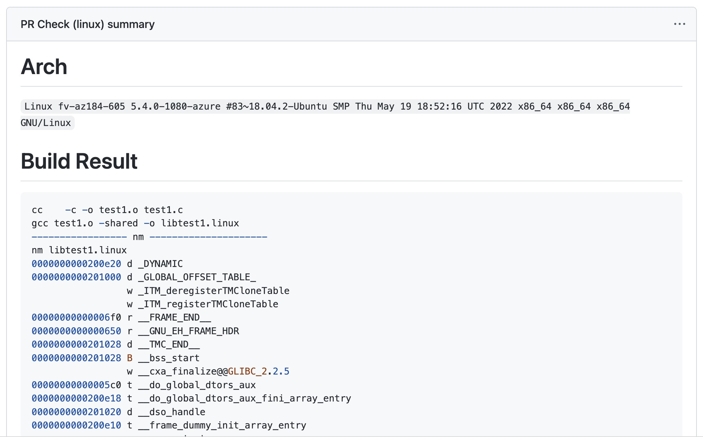

# CrossC2 Kit

[README](README.md) | [中文文档](README_zh.md)

CrossC2Kit is an infiltration expansion around the Unix platform derived from CrossC2. Use **Aggressor Script** Open Source Script engine. It can be used to create automation to simulate the operation process of the Red Team and expand the **CobaltStrike** client.

**CrossC2Kit** is inherited from the original features of **CobaltStrike**, so the development and writing grammar still refer to the official documentation: https://trial.cobaltstrike.com/aggressor-script/index.html




However, it has also performed some API expansion on CrossC2 to control the UNIX platform Beacon. The main functions are to perform the dynamic library (`.so` / `.dylib`) and executable files (`ELF` / `MachO`) and executable files from memory parsing. Script (`bash` / `python` / `php` ...). At the same time, some data set interfaces of CobaltStrike are reserved, such as
`portscan`, `screenshots`, `keylogger`, `credentials`, etc., can quickly develop **Portscan** and other kits. And if you are familiar with the CS native protocol, you can specify some more complicated data results for more flexible metadata collection.


## basic function

**`Interpreter related plug-ins`**、**`Password dump module`**、**`Authentication backdoor modules`**、**`Information collection modules`**、**`Traffic proxy module`**、**`Keylogger module`**、**`Privilege promotion module`**、**`Task management module`**

See wiki for details: [About CrossC2Kit](https://github.com/CrossC2/CrossC2Kit/wiki/About-CrossC2-Kit)

## API Reference: 

Memory loading related API: [API wiki](https://gloxec.github.io/CrossC2/zh_cn/api)

API function manual：[API Reference](https://github.com/CrossC2/CrossC2Kit/wiki/API-Reference)

API demo：[/third-party/api_demo/load.cna](https://github.com/CrossC2/CrossC2Kit/blob/e5bcf1a60a829c80bf7cc139841c6ccac968a43b/third-party/api_demo/load.cna)

## Custom expansion

Use **CrossC2Kit** to develop customized expansion:
Put the custom extension according to the classification, compilation source code, configuration file, etc. into the `third-party` Folder, the client will automatically load the extended `load.cna`

https://github.com/CrossC2/CrossC2Kit/blob/b108739d60abaafca66183fd1584bde6a8aa4aed/third-party/readme.md?plain=1#L11-L21

For details: https://github.com/CrossC2/CrossC2Kit/tree/template/third-party


## Pull Request

1. git clone https://github.com/CrossC2/CrossC2Kit.git
2. cd CrossC2Kit && mkdir third-party
3. Place the extended plug-in in the **third-party** directory and perform **Pull Request**
4. **Pull Request** will merge after automatic compilation


```c
├── third-party
│   ├── test.cna
│   └── util
│       ├── lpe  // Type of plugin
│       │   ├── cve-2021-1102       // The name of the plugin
│       │   │   ├── load.cna        // Loading file of the plug-in *
│       │   │   ├── readme.md       // Description document of plug-in
│       │   │   ├── src             // The source code directory of binary components in the plugin
│       │   │   │   ├── exp.c       // Source code to be compiled *
│       │   │   │   └── makefile    // Automatic compiled configuration file *
│       │   │   └── testa.cna       // CNA script used inside the plug-in
│       │   └── cve-2022-2202
│       │       ├── load.cna
│       │       ├── readme.md
│       │       └── src
│       │           ├── exp.c
│       │           └── makefile
│       └── pass
│           ├── linux-login
│           │   ├── load.cna
│           │   └── src
│           │       ├── exp.c
│           │       └── makefile
│           └── readme.md
```

5. The compilation results will be displayed in **Summary**, including
    
    `System architecture information`
    
    `Compile process`
    
    `Compilation results symbol information`
    
    `GLIBC version information contained in Linux programs`
    
    `The overall result of compilation` 
    





