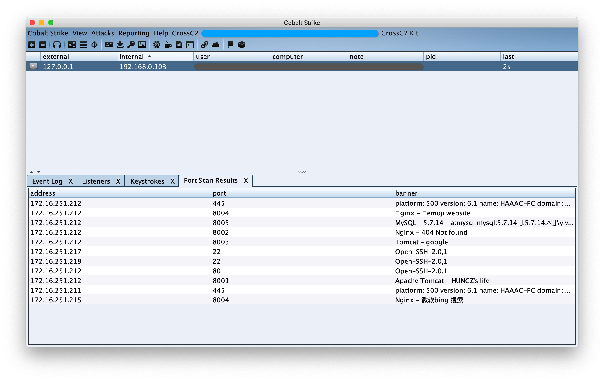

# CrossC2 Kit

[README](README.md) | [中文文档](README_zh.md)

CrossC2Kit 是围绕着CrossC2 衍生出的Unix平台后渗透扩展，采用 **Aggressor Script** 开源脚本引擎。可以用来创建自动化来模拟红队操作过程，以及扩展CobaltStrike客户端。

CrossC2Kit 整体继承于CobaltStrike原有的功能，所以开发与编写语法仍然参照官方文档: https://trial.cobaltstrike.com/aggressor-script/index.html


但它在 CrossC2 之上又进行了一些API拓展，用于控制 Unix 平台beacon，主要功能为从内存解析执行用户下发的 动态库 ( .so / .dylib ) 与 可执行文件 ( ELF / MachO ) 以及 脚本 ( bash / python / php ... )。同时预留了CobaltStrike的一些数据集接口，例如
`端口扫描`, `屏幕截图`, `键盘记录`, `密码凭证` 等等，可以快捷开发portscan等等套件。以及如果熟悉CS原生协议的话，可以指定更加复杂的一些数据结果等进行更灵活的元数据收集。


## 基础功能:

内存解释器、内存执行、密码dump、认证后门、信息收集（浏览器、keychain），流量代理，键盘记录模块，网络探测模块，权限提升，任务管理等。

详情见wiki: [About CrossC2Kit](https://github.com/CrossC2/CrossC2Kit/wiki/About-CrossC2-Kit)

## API 文档: 

内存加载相关API: [API wiki](https://gloxec.github.io/CrossC2/zh_cn/api)

API函数手册：[API Reference](https://github.com/CrossC2/CrossC2Kit/wiki/API-Reference)

API demo链接：[/third-party/api_demo/load.cna](https://github.com/CrossC2/CrossC2Kit/blob/e5bcf1a60a829c80bf7cc139841c6ccac968a43b/third-party/api_demo/load.cna)

## 自定义拓展：

使用 **CrossC2Kit** 开发自定义的扩展:
将自定义的扩展按照分类、编译源码，配置文件等放入`third-party`文件夹中，客户端将会自动加载扩展的`load.cna`

https://github.com/CrossC2/CrossC2Kit/blob/b108739d60abaafca66183fd1584bde6a8aa4aed/third-party/readme.md?plain=1#L11-L21

详见例子: https://github.com/CrossC2/CrossC2Kit/tree/template/third-party


## 插件提交方式

1. git clone https://github.com/CrossC2/CrossC2Kit.git
2. cd CrossC2Kit && mkdir third-party
3. 将扩展插件置入该目录后进行 pull request
4. pull request 项目将在自动编译通过后进行合并


```c
├── third-party
│   ├── test.cna
│   └── util
│       ├── lpe  // 插件分类
│       │   ├── cve-2021-1102       // 插件名称
│       │   │   ├── load.cna        // 插件启动入口 *
│       │   │   ├── readme.md       // 插件文档
│       │   │   ├── src             // 插件包含的二进制组件源码目录
│       │   │   │   ├── exp.c       // 待编译的源码 *
│       │   │   │   └── makefile    // 自动编译的工程配置文件 *
│       │   │   └── testa.cna       // 插件内部用到的cna脚本
│       │   └── cve-2022-2202
│       │       ├── load.cna
│       │       ├── readme.md
│       │       └── src
│       │           ├── exp.c
│       │           └── makefile
│       └── pass
│           ├── linux-login
│           │   ├── load.cna
│           │   └── src
│           │       ├── exp.c
│           │       └── makefile
│           └── readme.md
```

5. 编译结果将在 **summary** 中显示，包含
    
    `系统架构信息`
    
    `编译过程`
    
    `编译结果符号信息`
    
    `Linux包含GLIBC版本信息`
    
    `编译整体结果` 
    


